# Social Media Scraper Skills

[中文版](./README.zh-CN.md)

AI Agent Skills for the [Social Media Scraper](https://github.com/PLA-yi/social-media-scraper) project.

Each skill is a self-contained folder with two files:
- **`prompt.md`** — instructions for the AI agent (parameter parsing rules, how to call the script)
- **`run.py`** — standalone Python script that calls the local scraper server API

---

## How It Works

```mermaid
flowchart LR
    U(["👤 User Input"]) --> A["🤖 AI Agent\nreads prompt.md"]
    A --> R["⚙️ run.py"]
    R -->|POST /api/scrape| S["🖥️ Scraper Server\nlocalhost:8000"]
    S --> D["抖音"]
    S --> T["TikTok"]
    S --> Re["Reddit"]
    S --> Y["YouTube"]
    S --> X["X"]
    D & T & Re & Y & X --> Out[("📁 data/")]
```



---

## Folder Structure

```
Social Media Scraper Skills/
├── scrape-douyin-keyword/
│   ├── prompt.md        ← AI agent instructions
│   └── run.py           ← executable script
├── scrape-douyin-blogger/
│   ├── prompt.md
│   └── run.py
├── scrape-tiktok-keyword/
│   ├── prompt.md
│   └── run.py
├── scrape-tiktok-blogger/
│   ├── prompt.md
│   └── run.py
├── scrape-reddit/
│   ├── prompt.md
│   └── run.py
├── scrape-youtube/
│   ├── prompt.md
│   └── run.py
└── scrape-x/
    ├── prompt.md
    └── run.py
```

---

## Prerequisites

1. Clone and start the [Social Media Scraper](https://github.com/PLA-yi/social-media-scraper) server:
   ```bash
   git clone https://github.com/PLA-yi/social-media-scraper
   cd social-media-scraper
   python3 server.py
   ```
2. Server must be running at `http://localhost:8000` before executing any skill.

---

## Skills

| Skill | Function | Platform |
|-------|----------|----------|
| `scrape-douyin-keyword` | Keyword search — videos & comments | 抖音 Douyin |
| `scrape-douyin-blogger` | Creator profile scraping | 抖音 Douyin |
| `scrape-tiktok-keyword` | Keyword search — videos & comments | TikTok |
| `scrape-tiktok-blogger` | Creator profile scraping | TikTok |
| `scrape-reddit` | Keyword search / subreddit scraping | Reddit |
| `scrape-youtube` | Keyword search / channel scraping | YouTube |
| `scrape-x` | Keyword search / profile scraping | X (Twitter) |

---

## Usage

### Run directly

```bash
# Douyin keyword (fast mode, 20 videos)
python3 scrape-douyin-keyword/run.py --keyword "新能源汽车" --count 20 --mode fast

# TikTok keyword (safe mode)
python3 scrape-tiktok-keyword/run.py --keyword "Claude AI" --count 20 --mode safe

# Douyin blogger profile
python3 scrape-douyin-blogger/run.py --url "https://v.douyin.com/xxxxx" --count 30

# TikTok creator profile
python3 scrape-tiktok-blogger/run.py --url "https://www.tiktok.com/@username" --count 20

# Reddit keyword search
python3 scrape-reddit/run.py --target "AI tools" --mode keyword --count 20

# YouTube channel
python3 scrape-youtube/run.py --target "https://www.youtube.com/@channel" --mode blogger --count 10

# X keyword search
python3 scrape-x/run.py --target "Anthropic Claude" --mode keyword --count 50
```

### As Agent Skills
Point your AI agent to a skill folder. The agent reads `prompt.md` for instructions, extracts parameters from user input, then executes `run.py`.

---

## Parameters

### Douyin / TikTok — Keyword

| Parameter | Default | Description |
|-----------|---------|-------------|
| `--keyword` | required | Search keyword |
| `--count` | `20` | Number of videos to scrape |
| `--mode` | `safe` | `safe` sequential / `fast` 3× concurrent tabs |
| `--sort` | `0` | `0` recommended · `1` latest · `2` most liked |
| `--time_filter` | `0` | Hours limit (`0` = no limit) |

### Douyin / TikTok — Blogger

| Parameter | Default | Description |
|-----------|---------|-------------|
| `--url` | required | Profile URL (short links supported) |
| `--count` | `20` | Number of videos to scrape |

### Reddit / YouTube / X

| Parameter | Default | Description |
|-----------|---------|-------------|
| `--target` | required | Keyword or profile/channel URL |
| `--mode` | `keyword` | `keyword` search / `blogger` profile |
| `--count` | `20` | Number of items to scrape |

---

## Scrape Mode Comparison

```mermaid
graph TD
    subgraph safe["🐢 Safe Mode"]
        S1[Video 1] --> S2[Video 2] --> S3[Video 3]
    end
    subgraph fast["🚀 Fast Mode (3× speed)"]
        F1[Video 1]
        F2[Video 2]
        F3[Video 3]
    end
```



> **Fast mode** opens 3 concurrent browser tabs within the same session — no extra login or configuration needed.

---

## Auth Notes

| Platform | Method |
|----------|--------|
| 抖音 / TikTok | Browser auto-opens on first run; cookies saved automatically |
| Reddit / X | Export login cookies with [Cookie-Editor](https://cookie-editor.com), save as `data/cookies.json` |
| YouTube | No login required |

---

## Related

- Main project: [PLA-yi/social-media-scraper](https://github.com/PLA-yi/social-media-scraper)
