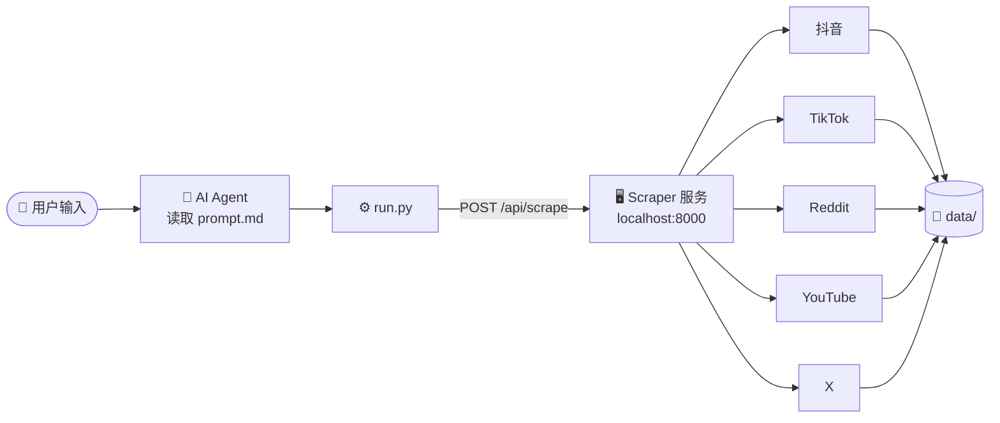
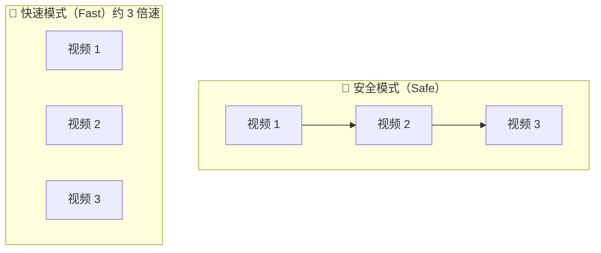

# Social Media Scraper Skills

[English](./README.md)

适用于 [Social Media Scraper](https://github.com/PLA-yi/social-media-scraper) 项目的 AI Agent Skills。

每个 Skill 是一个独立文件夹，包含两个文件：
- **`prompt.md`** — AI Agent 指令（参数解析规则、脚本调用方式）
- **`run.py`** — 独立 Python 脚本，调用本地 scraper 服务 API

---

## 工作原理



---

## 文件结构

```
Social Media Scraper Skills/
├── scrape-douyin-keyword/
│   ├── prompt.md        ← AI Agent 指令
│   └── run.py           ← 可执行脚本
├── scrape-douyin-blogger/
│   ├── prompt.md
│   └── run.py
├── scrape-tiktok-keyword/
│   ├── prompt.md
│   └── run.py
├── scrape-tiktok-blogger/
│   ├── prompt.md
│   └── run.py
├── scrape-reddit/
│   ├── prompt.md
│   └── run.py
├── scrape-youtube/
│   ├── prompt.md
│   └── run.py
└── scrape-x/
    ├── prompt.md
    └── run.py
```

---

## 前置条件

1. 克隆并启动 [Social Media Scraper](https://github.com/PLA-yi/social-media-scraper) 服务：
   ```bash
   git clone https://github.com/PLA-yi/social-media-scraper
   cd social-media-scraper
   python3 server.py
   ```
2. 执行任何 Skill 前，服务必须运行在 `http://localhost:8000`。

---

## Skills 一览

| Skill 文件夹 | 功能 | 平台 |
|-------------|------|------|
| `scrape-douyin-keyword` | 关键词搜索，采集视频和评论 | 抖音 |
| `scrape-douyin-blogger` | 博主主页作品采集 | 抖音 |
| `scrape-tiktok-keyword` | 关键词搜索，采集视频和评论 | TikTok |
| `scrape-tiktok-blogger` | 创作者主页作品采集 | TikTok |
| `scrape-reddit` | 关键词搜索 / subreddit 采集 | Reddit |
| `scrape-youtube` | 关键词搜索 / 频道采集 | YouTube |
| `scrape-x` | 关键词搜索 / 用户主页采集 | X（推特） |

---

## 使用方法

### 直接运行

```bash
# 抖音关键词（快速模式，20 条视频）
python3 scrape-douyin-keyword/run.py --keyword "新能源汽车" --count 20 --mode fast

# TikTok 关键词（安全模式）
python3 scrape-tiktok-keyword/run.py --keyword "Claude AI" --count 20 --mode safe

# 抖音博主主页
python3 scrape-douyin-blogger/run.py --url "https://v.douyin.com/xxxxx" --count 30

# TikTok 创作者主页
python3 scrape-tiktok-blogger/run.py --url "https://www.tiktok.com/@username" --count 20

# Reddit 关键词搜索
python3 scrape-reddit/run.py --target "AI tools" --mode keyword --count 20

# YouTube 频道采集
python3 scrape-youtube/run.py --target "https://www.youtube.com/@channel" --mode blogger --count 10

# X 关键词搜索
python3 scrape-x/run.py --target "Anthropic Claude" --mode keyword --count 50
```

### 作为 Agent Skills 使用
将 AI Agent 指向某个 Skill 文件夹，Agent 读取 `prompt.md` 获取指令，从用户输入中提取参数，然后执行 `run.py`。

---

## 参数说明

### 抖音 / TikTok — 关键词搜索

| 参数 | 默认值 | 说明 |
|------|--------|------|
| `--keyword` | 必填 | 搜索关键词 |
| `--count` | `20` | 采集视频数量 |
| `--mode` | `safe` | `safe` 顺序采集 / `fast` 3 路并发（约 3 倍速） |
| `--sort` | `0` | `0` 默认推荐 · `1` 最新发布 · `2` 最多点赞 |
| `--time_filter` | `0` | 时间限制（小时），`0` 不限 |

### 抖音 / TikTok — 博主主页

| 参数 | 默认值 | 说明 |
|------|--------|------|
| `--url` | 必填 | 主页链接（支持短链） |
| `--count` | `20` | 采集视频数量 |

### Reddit / YouTube / X

| 参数 | 默认值 | 说明 |
|------|--------|------|
| `--target` | 必填 | 关键词或主页/频道链接 |
| `--mode` | `keyword` | `keyword` 搜索 / `blogger` 主页采集 |
| `--count` | `20` | 采集数量 |

---

## 爬取模式对比



> **快速模式** 在同一浏览器会话中同时开启 3 个标签页并发采集，无需额外配置或登录。

---

## 鉴权说明

| 平台 | 鉴权方式 |
|------|----------|
| 抖音 / TikTok | 首次运行时浏览器自动弹出，手动登录后 Cookie 自动保存 |
| Reddit / X | 用 [Cookie-Editor](https://cookie-editor.com) 插件导出登录 Cookie，保存为 `data/cookies.json` |
| YouTube | 无需登录 |

---

## 相关链接

- 主项目：[PLA-yi/social-media-scraper](https://github.com/PLA-yi/social-media-scraper)
